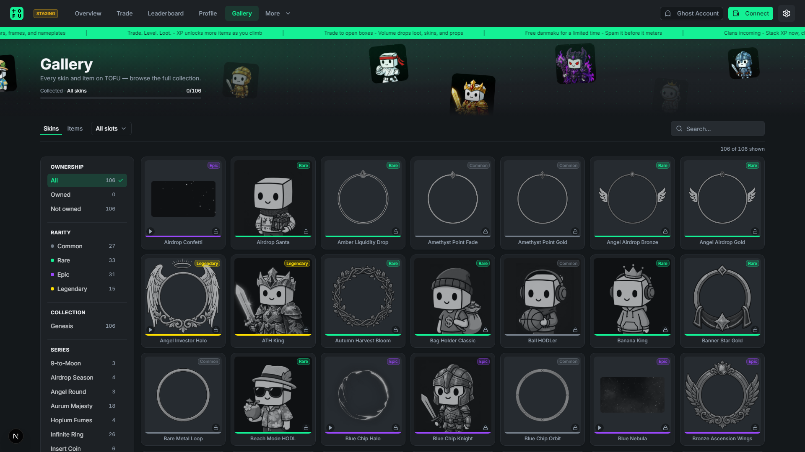

Your look is your legacy. Dress accordingly.

<!-- IMG: profile page with equipped frame + nameplate screenshot -->

### The cosmetic system

TOFU's identity layer is fully customizable, with every piece earned or collected:

* **Avatars** — your face on the platform, from default Tofus to rare collectibles.
* **Avatar Frames** — animated borders around your avatar. A Legendary frame announces you before you type a word.
* **Nameplates** — custom backgrounds behind your name in chat and leaderboards.
* **Danmaku Styles** — how your bullet comments look flying across the chart.

### Rarity tiers

Every cosmetic has a rarity: **Common → Rare → Epic → Legendary**. Rarity is visible everywhere — colored accents, badges, and effects scale with tier. Some items are **Limited**: retired from acquisition forever, still fully usable. Owning one marks you as early.

### My Warehouse & My Bags

Your profile houses your collection:

* **My Warehouse** — every cosmetic you own: equip, inspect, and admire.
* **My Bags** — consumables and items (rename cards, gift items, boosts).
* Equipping is one click; changes apply instantly across chat, danmaku, and leaderboards.

<!-- IMG: warehouse grid screenshot -->

### Gallery

The full collection index — every item that exists on the platform, including the ones you don't own yet. Track your completion, scout what's still obtainable, and covet the Limited pieces you missed.

### How to get cosmetics

* **Trading Drops** (blind boxes) — the main faucet.
* **Store** — direct purchase for select items.
* **Achievements & level rewards** — earned, not bought.
* **Events** — limited runs tied to platform moments.

***These aren't just JPEGs. They're receipts of your journey.***
