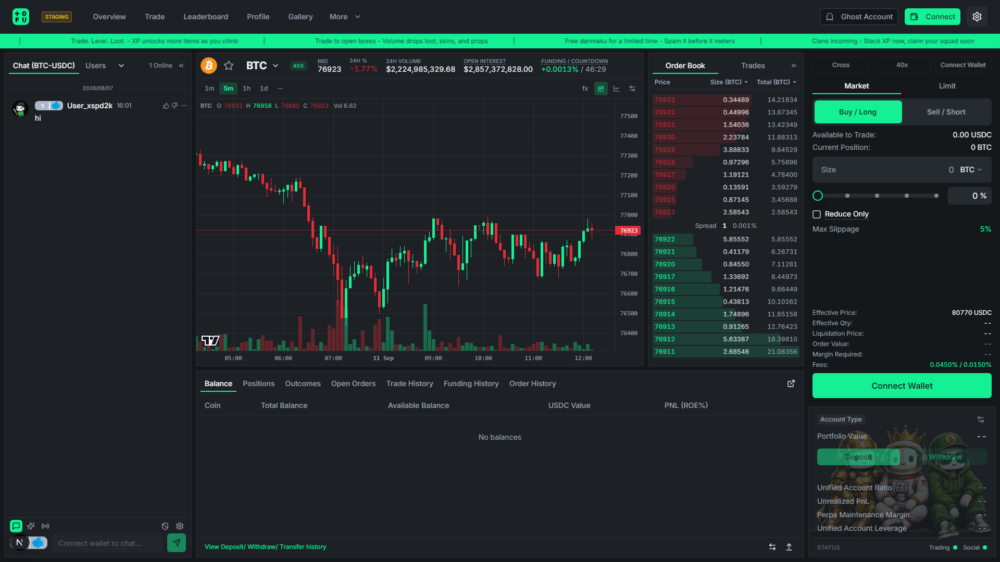
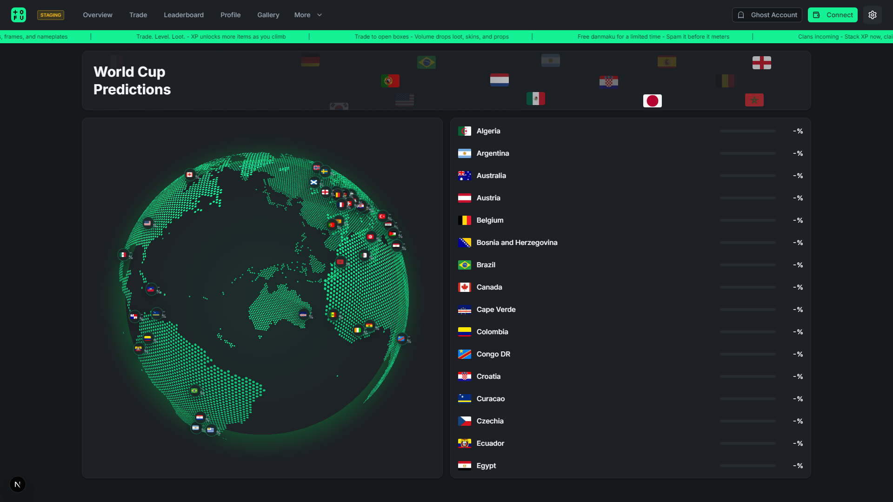

Three ways to play, one unified interface.

### Spot

Buy and hold real tokens with USDC. Full order book trading with the same charts, chat, and danmaku as everywhere else. Your spot balances live in your portfolio and can be sent or transferred any time.

### Perpetuals

Long or short with leverage on the majors and the movers:

* Adjustable leverage with clear margin and liquidation display.
* Real-time funding rates shown in the market banner.
* Cross and isolated margin support.
* Powered by Hyperliquid's perp engine — deep liquidity, fast fills.

### Outcome Markets

Prediction-style markets on real-world questions — sports, crypto events, and more. Each question resolves to a side, and each side trades like a token:

* **Question pages** aggregate all outcomes of an event in one view (e.g., a tournament page listing every team).
* Buy the side you believe in; prices reflect the crowd's live probability.
* Same social layer: every outcome market has its chatroom and danmaku, so you can talk trash while you back your team.

### Finding markets

* **Token selector** — search and browse every market, with favorites (⭐) pinned to the top.
* **Overview page** — the full market table: price, 24h change, volume, funding, sorted your way.
* **Favorites** sync across devices and shape your default view.

***Back the narrative you believe in — with size.***
