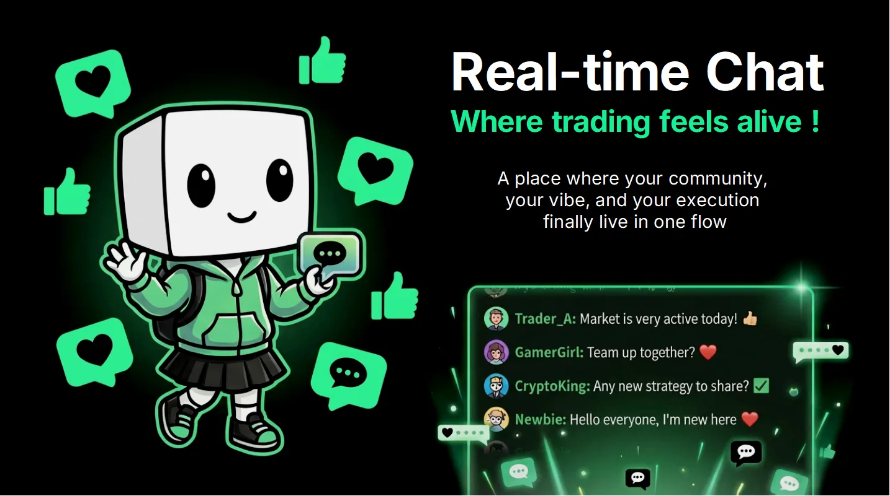

import { Image } from 'astro:assets';
import chatPanel from '../../../assets/screenshots/dex-chat-panel-hd.png';

Every token is a room. Every room is alive.

### Token rooms

  

    <Image src={chatPanel} alt="A token room — avatars, level badges, replies, and global messages" />
  

  

    Each market has its own live chatroom, right next to the chart. The people in the room are the people trading the token — sentiment, alpha, and cope in real time.

    * **Live messages** with user avatars, level badges, and equipped cosmetics — a Level 40 whale looks like a Level 40 whale.
    * **Replies and reactions** — thumbs up the alpha, dunk on the fade.
    * **Global messages** surface in every room with a tag, so platform-wide callouts reach you wherever you trade.
  

### Global chat

One platform-wide room where everyone hangs out — cross-token banter, platform announcements, and the loudest wins (and losses) of the day.

### Personal messages

Direct notifications and personal events — level-ups, rewards, and platform announcements — delivered to your personal channel.

### Chat identity

Your chat presence *is* your trading identity:

* **Level badge** next to your name, everywhere you speak.
* **Avatar frame and nameplate** from your equipped cosmetics.
* **Chat tier title** that grows with you — see [XP & Levels](/dex/xp-levels/).

### Moderation & safety

Room moderation tools, rate limits, and reporting keep rooms fun instead of feral. Guests can read; signing in unlocks speaking.

***The group chat and the trade button, finally on the same screen.***
