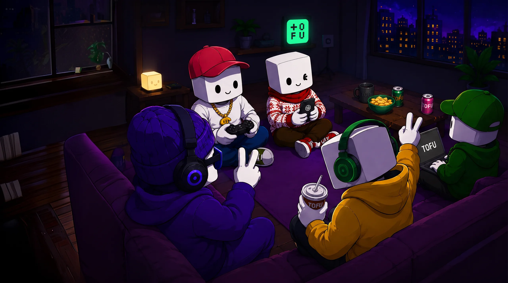

> 🚧 **Coming Soon** — clans are incoming. Stack XP now, claim your squad soon.

Don't grind alone either. Build your Clan.

### What are Clans?

Clans are TOFU's community layer — living squads that form around KOLs, top traders, and friend groups. A clan is a shared identity, a shared effort, and a shared payoff: your clan tag travels with you through chat, leaderboards, and profiles.

### Bring your people

Clans are built to be *grown*. Every clan gets its own **invite code** — a join code you can shill to your network like a referral link, except it doesn't just pay once and die:

* Share your clan's code; whoever joins with it becomes part of your squad, not just a line in a dashboard.
* Members help each other, share strategies, and push the same banner up the rankings.
* The more your people trade and win together, the more the whole clan benefits — recruiting *is* contributing.

### Creating & joining

* Users with sufficient level and trading volume can **create a clan** — custom name, avatar, banner, and description.
* Everyone else can browse clans, **apply to join**, or enter directly with a clan's invite code. Clan leaders manage recruitment.

### Clan Treasury

Every clan runs a shared treasury:

* **Funded by** trading fee rebates from member activity, clan war winnings, and donations.
* **Used for** member rewards, game props, and withdrawals per clan policy.
* Full transparency — every inflow and outflow is visible to members.

### Clan Wars

Time-limited competitions where clans battle on trading volume or specific tasks:

* Winning clans earn treasury prizes and — the crown jewel — **token room occupation**: the winning clan's banner displayed on a token's trading page, plus a share of that token's trading fees for the occupation period.
* War records and **clan achievements** build your clan's legacy over seasons.

### Why clans beat referral links

A referral link pays once and dies. A clan compounds: members help each other, share strategies, complete challenges together, and split the spoils. Community as an asset class.

***Trading is a team sport now.***
