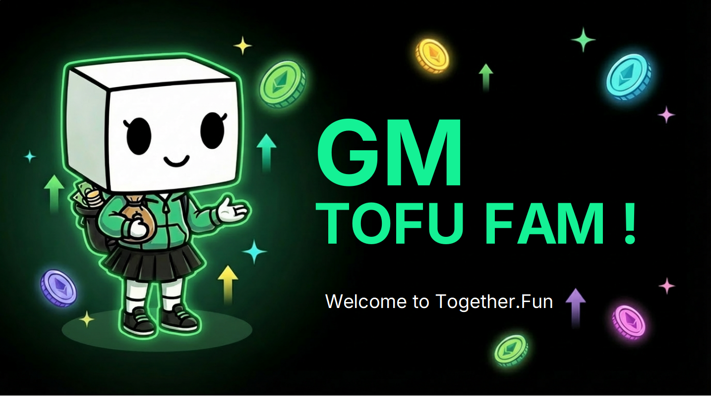
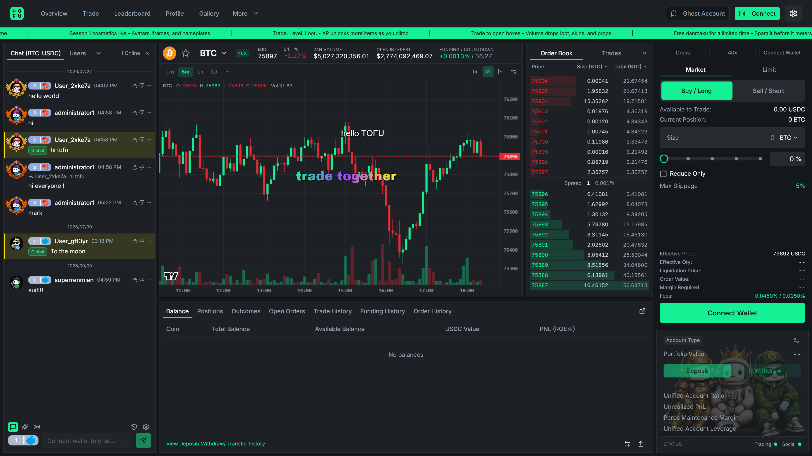

Don't trade alone. This time, your voice gets heard.

The TOFU Dex is the main stage of Together.fun: a real trading venue — spot, perps, and outcome markets powered by Hyperliquid — rebuilt around one idea: **trading is better together**. Everything that used to live in three other tabs now lives on the chart itself.

### Every token is a live room

The chart and the community share one screen. Each market has its own chatroom where the people trading the token talk in real time — sentiment, alpha, and cope, right next to the candles. A global room connects the whole platform.

### Danmaku: the crowd on the chart

Comments fly across the chart itself. When the candle rips, you see the room lose its mind in real time. Cold, silent charts are dead — ours talk back.

### An identity you can collect

Avatars, animated frames, nameplates, and danmaku styles across four rarity tiers. Your level badge follows you into every room. On TOFU, your look is earned — and everyone can tell.

### Trading Drops

Blind boxes earned through trading volume. Open them for cosmetics, consumables, and rare pulls that make the whole room jealous. The more you trade, the more you unlock.

That's the idea. Here's what it looks like when you sit down to trade.

Under the playful skin sits serious infrastructure. The Dex runs on **Hyperliquid**: professional-grade execution, deep liquidity, and real markets — without the professional-grade boredom.

### One screen, everything live

* **Trade** — candlestick charts, order book, one-tap HYPE/DUMP execution.
* **Chat** — every token has its own live room; a global room connects the whole platform.
* **Danmaku** — comments fly across the chart in real time. Price action becomes a crowd experience.
* **Level Up** — every trade earns XP. Unlock avatars, frames, nameplates, and Trading Drops as you climb.

### And we're just getting started

The social layer keeps growing — more ways to celebrate together, more things to collect, more reasons to bring your crew. Peek at what's [coming soon](/dex/coming-soon/).

***Your alpha feed, your community, and your trade button are finally in one place.***
