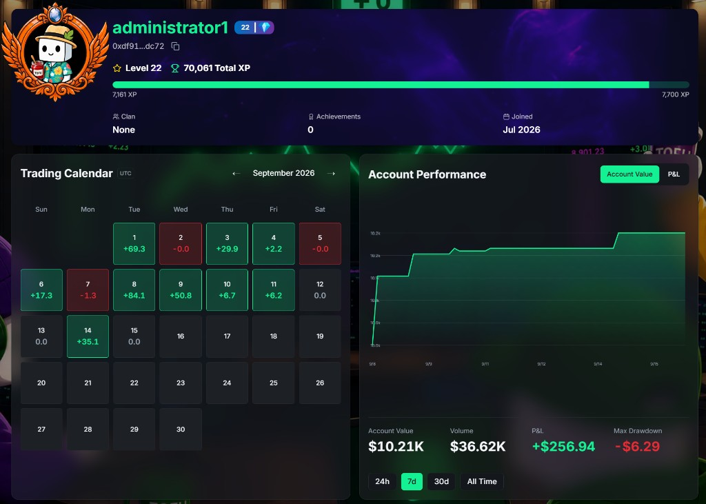

Your trading story, fully receipted.

### Portfolio overview

* **Balance banner** — total account value, available margin, and quick actions (Deposit / Withdraw / Transfer / History).
* **PnL calendar** — your daily profit and loss at a glance, green days and red days laid out like a heatmap. Consistency (or chaos) made visible.
* **Performance charts** — account value and PnL over time.

### Complete history

Every event in your account, timestamped and filterable:

* **Trade History** — every fill with price, size, fees, and direction.
* **Order History** — every order placed, filled, cancelled, or rejected.
* **Funding History** — every funding payment on your perp positions.
* **Capital Flow** — deposits, withdrawals, and transfers.

### Public profile

Your profile page is your trophy room — and it's visible to others:

* Level badge and avatar, with your equipped frame and nameplate on display.
* Trading stats and performance overview.
* Your warehouse of collected items and cosmetics.

*Privacy note: you control what's showcased. Flex is opt-in.*

***On other platforms, a loss is a number. On TOFU, it's a story.***
