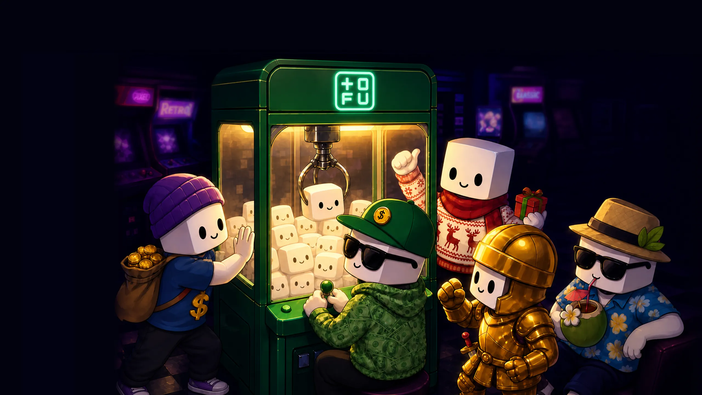

import mysteryBox from '../../../assets/illustration/mystery-box.webp';
import chestTofu from '../../../assets/illustration/withdraw.webp';
import nameCard from '../../../assets/items/name-card.png';
import clanNameCard from '../../../assets/items/clan-name-card.png';
import frSovereign from '../../../assets/cosmetics/frame-golden_sovereign_wings.webp';
import avBanana from '../../../assets/cosmetics/avatar-banana_king.webp';

Trade. Earn boxes. Open boxes. Feel things.

### What are Trading Drops?

Trading Drops are TOFU's blind box system — loot boxes earned through platform activity and opened for randomized rewards. It's the surprise-and-delight engine of the Dex: the box doesn't tell you what's inside, and that's the whole point.

### Earning boxes

* **Trading volume** — the primary faucet. Volume milestones drop boxes automatically.
* **Level rewards** — key levels on your XP track include boxes.
* **Events** — special boxes from milestones and limited-time events.

### Opening boxes

The opening is a *moment* — full-screen reveal animation, rarity suspense, and the room-shaking glow when a Legendary drops.

Inside a box:

* **Cosmetics** — avatars, frames, nameplates, danmaku styles across all rarity tiers.
* **Consumables** — rename cards, gift items, boosts.
* **Points & XP** — direct progression fuel.
* **Rare pulls** — low-probability, high-flex items that make the whole room jealous.

A sample of what falls out:

  

    
    Avatar — Banana King
  

  

    
    Frame — Golden Sovereign Wings
    Legendary
  

  

    
    Item — Rename Card
  

  

    
    Item — Clan Name Card
  

### Rarity & odds

Every box shows its **drop table and odds** before you open — transparent probabilities, no black boxes (ironically). Rarity follows the platform standard:

Common → Rare → Epic → Legendary

### Duplicates

Duplicate items convert into value rather than dead weight — your collection always moves forward.

***The more you trade, the more you unlock.***
