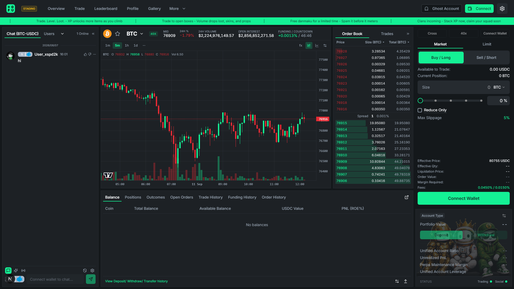
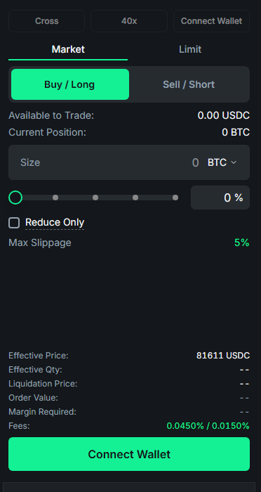
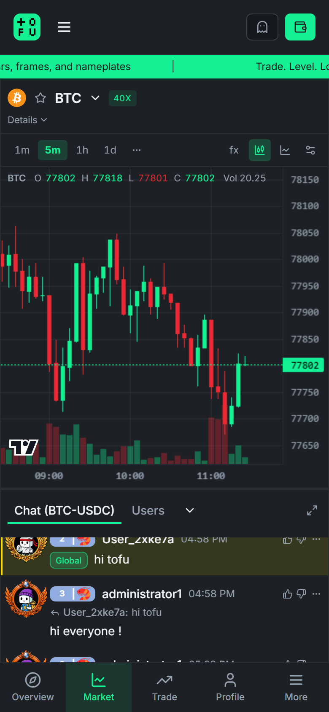

One screen. Chart, order book, chat, danmaku, and your positions — all live, all at once.

### The chart

* Professional candlestick charts with multiple intervals (1m → 1D), powered by TradingView's charting engine.
* Live danmaku overlay — community comments fly across the chart without ever blocking your interactions. Toggle it off any time you need pure focus.
* Real-time price, 24h change, volume, and funding stats in the banner above the chart.

### Order book & trades

* Live order book with depth, grouped price levels, and one-click price fill (tap a level to load it into your order form).
* Recent trades stream in real time.

### The order form

* **Market & Limit orders** with slippage protection built in.
* Size presets and a percentage slider — go from idea to filled in two taps.
* For perps: leverage control, margin mode, and liquidation price shown *before* you commit.
* **HYPE** (buy/long) is green. **DUMP** (sell/short) is red. You will not mix them up.

### Positions & orders

Below the chart, your live account state:

* **Positions** — entry, mark, PnL, liquidation price, one-click close.
* **Open Orders** — live limit orders with one-click cancel.
* **Fills, Funding & Order History** — every event, timestamped and exportable to your portfolio view.

### Mobile

The entire interface is mobile-first: swipe between the market view and trade view, with the same chart, chat, and danmaku experience in your pocket.

***No complex charts. Just vibes — with professional execution underneath.***
