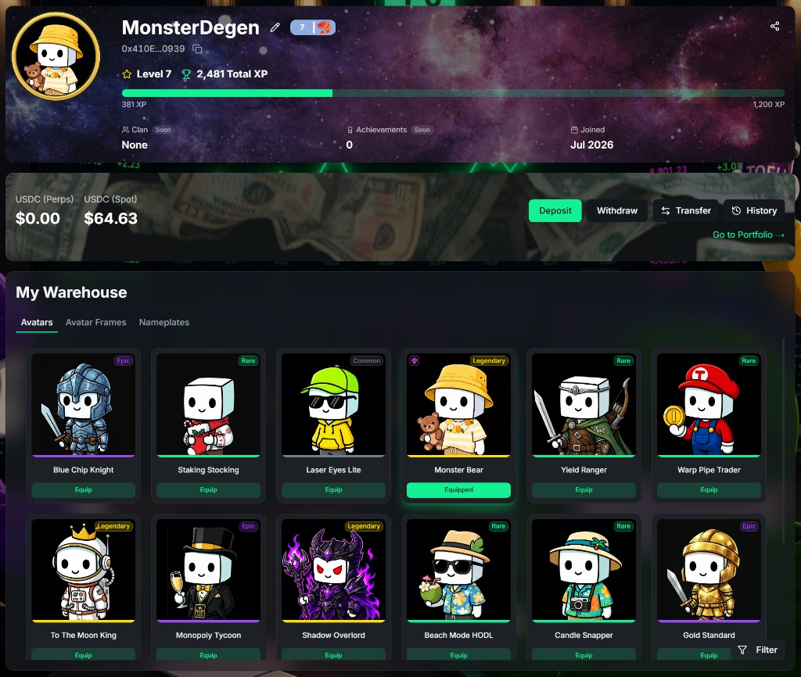

On TOFU, your account isn't a login — it's a character sheet. Everything you do here builds it.

### Everything grows on your account

* **Level & XP** — every trade earns XP; your level badge follows you into chat, danmaku, and leaderboards.
* **Avatars, frames & nameplates** — cosmetics you unlock, win, or pull from Trading Drops. Equip them and the whole platform sees.
* **My Warehouse** — your personal collection: every avatar, frame, and item you've ever earned, on shelves you fill over time.
* **Your record** — trading stats, milestones, and history that stay on your profile permanently.

None of it is bolted on. Your look, your rank, and your warehouse are all products of the same thing: how you've traded and who you've been in the room. Two accounts never read the same.

### Explore the progression layer

| Page | What's in it |
| --- | --- |
| [XP & Levels](/dex/xp-levels/) | How XP is earned and what your level unlocks |
| [Avatars & Cosmetics](/dex/cosmetics/) | The full cosmetic system — rarities, equipping, the gallery |
| [Trading Drops](/dex/trading-drops/) | Loot boxes earned by trading volume |
| [What's Next](/dex/coming-soon/) | Progression features still in the oven |

***Your portfolio tells your story. Your profile shows the character who lived it.***
