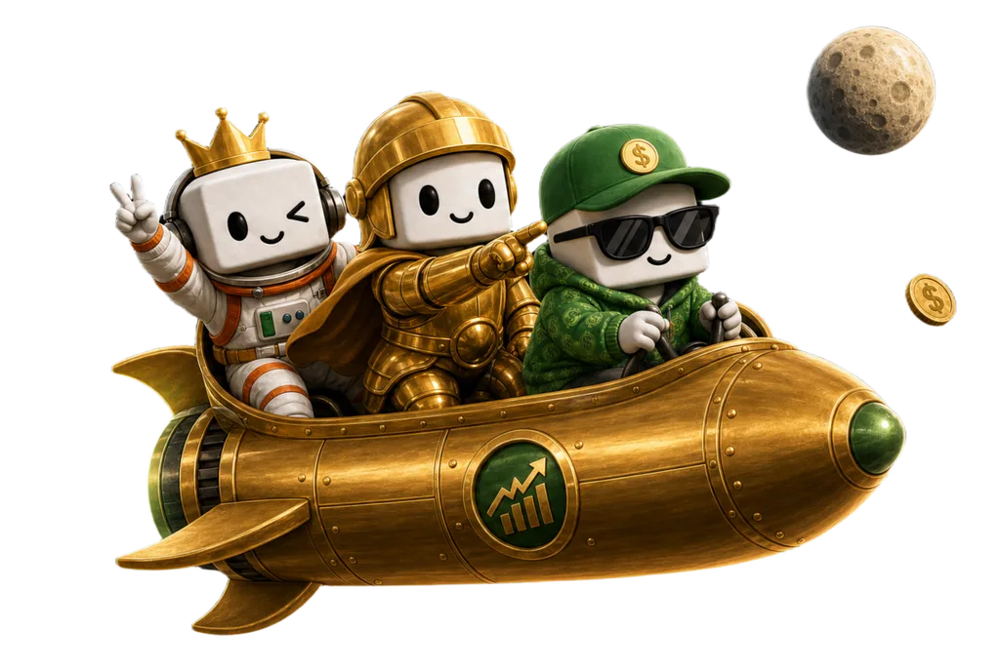

import { CardGrid, LinkCard } from '@astrojs/starlight/components';

**Together.fun (TOFU)** is a gamified social trading platform built for the modern crypto participant: the degen, the meme-lover, the alpha hunter.

### Brand Identity

| **Element**      | **Details**                                                                                                                           |
| ---------------- | ------------------------------------------------------------------------------------------------------------------------------------- |
| **Project Name** | Together.fun (**TOFU**)                                                                                                               |
| **Token**        | $TOFU (**TBA**)                                                                                                                       |
| **Slogan**       | **Together, We Farm Fun.**                                                                                                            |
| **One-Liner**    | The gamified trading platform where the **community is the alpha**, **execution is a game**, and **your portfolio tells your story**. |

### What is TOFU?

The old world of trading is lonely, complex, and joyless. Charts on one tab, alpha on another, your community on a third — and none of them talk to each other.

**The TOFU Trading Arcade** puts everything on one screen: real markets with real liquidity, a live chatroom for every token, danmaku comments flying across the chart, gifts and red envelopes raining during pumps, and a progression system that turns your trading history into an identity you can flex.

* **Social-First** — every token is a live room. Chat, danmaku, streams, and gifts happen right on top of the chart.
* **Gamified Execution** — HYPE and DUMP buttons, XP for every trade, blind boxes for volume, achievements for milestones.
* **Real Trading, Real Performance** — powered by Hyperliquid's high-performance infrastructure: spot, perps, and outcome markets with professional-grade execution under a playful skin.

***Together, We Farm Fun.*** We are the vibe. And the future is fun.

Join us. Let's farm it together.

### Jump right in

<CardGrid>
  <LinkCard
    title="The Tofu Arcade"
    description="Trade, chat, and level up — the five pillars of gamified trading."
    href="/tofu-docs/arcade-overview/"
  />
  <LinkCard
    title="Why TOFU"
    description="The problem, the solution, the landscape."
    href="/tofu-docs/the-problem/"
  />
  <LinkCard
    title="The Team"
    description="Institutional Discipline. Native Cultural Insight."
    href="/tofu-docs/the-team/"
  />
</CardGrid>
