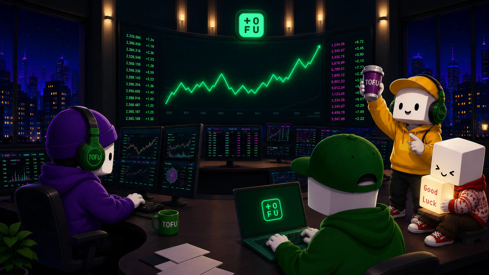

import { CardGrid, LinkCard } from '@astrojs/starlight/components';
import tofuGirl from '../../assets/brand/tofu-girl-inviting.png';

**Together.fun (TOFU)** is a social trading platform built for the modern crypto participant: the degen, the meme-lover, the alpha hunter. Real markets, powered by Hyperliquid — with your whole community trading right beside you.

### What is TOFU?

The old world of trading is lonely, complex, and joyless. Charts on one tab, alpha on another, your community on a third — and none of them talk to each other.

**TOFU Dex** puts everything on one screen: real markets with real liquidity, a live chatroom for every token, danmaku comments flying across the chart, and a collection layer that turns your trading history into an identity you can flex.

* **Social-First** — every token is a live room. Chat and danmaku happen right on top of the chart. Don't trade alone: this time, your voice gets heard.
* **Real Trading, Real Performance** — powered by Hyperliquid's high-performance infrastructure: spot, perps, and outcome markets with professional-grade execution.
* **An Identity Worth Building** — XP, levels, avatars, frames, and Trading Drops. Your portfolio tells your story.

### Brand Identity

  
  <table class="bi-table">
    <tbody>
      <tr>
        <th>Element</th>
        <th>Details</th>
      </tr>
      <tr>
        <td>Project Name</td>
        <td>Together.fun (<strong>TOFU</strong>)</td>
      </tr>
      <tr>
        <td>Slogan</td>
        <td><strong>Together, We Farm Fun.</strong></td>
      </tr>
      <tr>
        <td>One-Liner</td>
        <td>The social trading platform where the <strong>community is the alpha</strong> and <strong>your portfolio tells your story</strong>.</td>
      </tr>
    </tbody>
  </table>

***Together, We Farm Fun.*** We are the vibe. And the future is fun.

### Jump right in

<CardGrid>
  <LinkCard
    title="The TOFU Dex"
    description="Trade, chat, and level up — social trading, done right."
    href="/dex/introduction/"
  />
  <LinkCard
    title="Why TOFU"
    description="The problem, the solution, the landscape."
    href="/tofu-docs/the-problem/"
  />
  <LinkCard
    title="The Team"
    description="Institutional Discipline. Native Cultural Insight."
    href="/tofu-docs/the-team/"
  />
</CardGrid>
