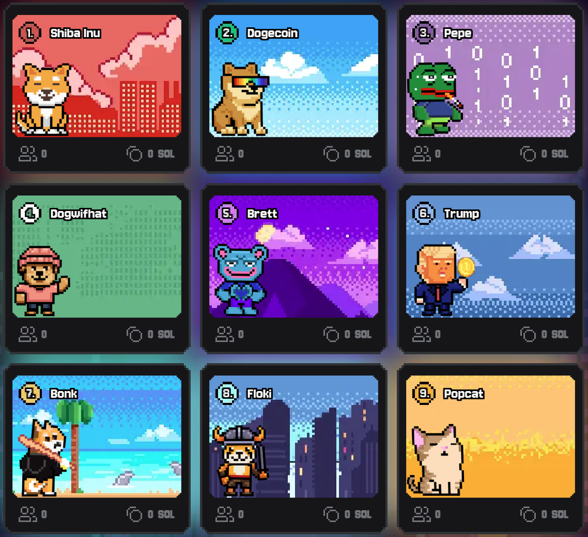

Before the Arcade, there was the arena.

**RugPad Royale** was Together.fun's Season 1 — a satirical, provably fair PvP simulation of the memecoin market on Solana. Nine meme-themed sectors, one on-chain VRF verdict, winners split the pot. It was our cultural on-ramp: it onboarded our earliest community, distributed XP and NFTs, and proved that trading mechanics can be genuinely fun.

### What Season 1 established

* **Provable fairness** — every outcome decided by on-chain VRF, contracts audited by **Hashlock** ([audit report](https://hashlock.com/audits/together-fun)).
* **PvP, not house-vs-player** — wealth transferred between players, never printed against them.
* **The progression foundation** — XP, avatars, achievements, and NFT rarity tiers that now power the Arcade's identity system.

### Your Season 1 legacy carries over

Season 1 has wrapped, but nothing you earned is lost:

* **XP → $TOFU**: all XP accumulated during Season 1 will be factored into the $TOFU airdrop allocation at TGE.
* **NFT multipliers**: the type, rarity, and quantity of your Season 1 NFTs act as multipliers for your future allocation.
* **Cross-platform identity**: your Season 1 reputation and assets bridge to your Arcade profile — early grinders get recognized.

*Exact conversion formulas and snapshot details will be announced closer to TGE. Follow [our X](https://x.com/togetherdotfun) for updates.*
