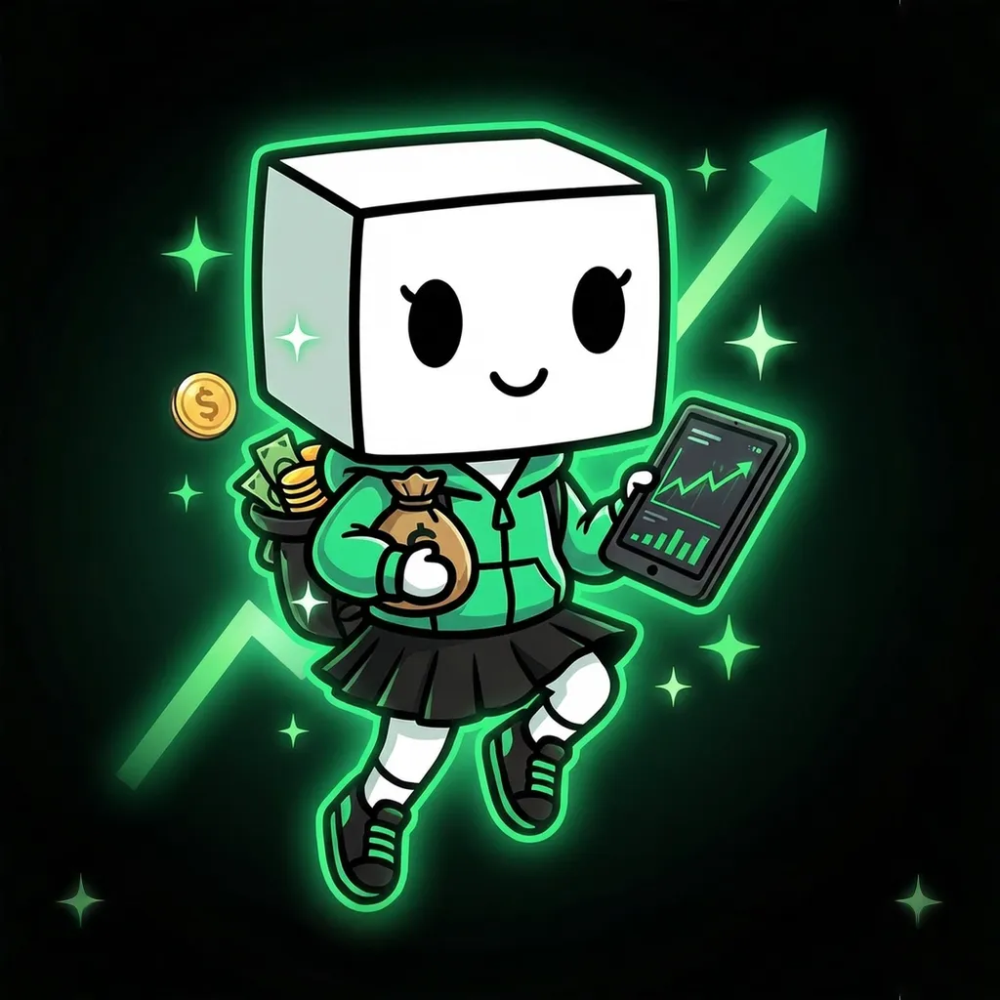

Together.fun

Robinhood didn't win by being a better Bloomberg; it won by being *nothing like Bloomberg*. It was simple, mobile-native, and social. It understood its users didn't love finance — they loved the *game* of finance. Together.fun takes that playbook and upgrades it for the crypto-native generation.

If the market is a casino, we're building the most fun casino on the internet. If trading is a social game, we're building the stadium. Together.fun is the first platform that accepts a fundamental truth: in the age of web3/crypto, vibes are the new value.

### Core Value Propositions

#### All-in-One Social Trading Hub

A multi-dimensional live space where charts, danmaku comments, and live chat converge in real time — one screen, no switching. Your alpha feed, your community, and your trade button are finally in one place. Don't trade alone: this time, your voice gets heard.

#### Effortless Execution

Intuitive HYPE/DUMP controls and surprise rewards from trading — all running on Hyperliquid's professional-grade execution engine. Simple on the surface, serious underneath.

#### Identity & Legacy System

A progression system that transforms your trading journey into a legacy: XP and levels, unlockable avatars and frames, Trading Drops, and a place in the community's Hall of Fame.

#### A Community That Compounds

And this is just the start — clans, community events, and more social surprises are on the way, turning followings into squads and trades into shared moments.

→ Dive into every feature in the **[TOFU Dex](/dex/introduction/)** docs.
