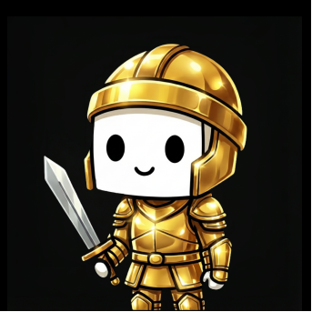
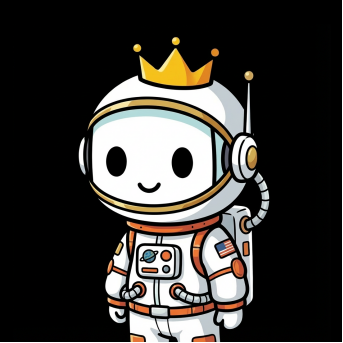
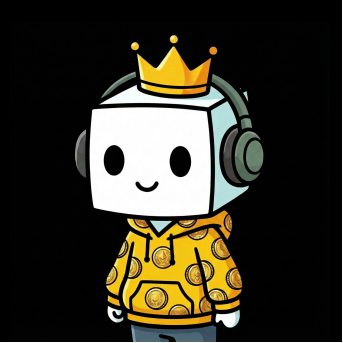

Institutional Discipline. Native Cultural Insight.

The Together.fun team combines the rigor of institutional finance with the cultural fluency of digital natives. The founding team hails from a successful hedge fund, bringing deep experience in probability games, market microstructure, risk management, and high-performance trading systems.

### Team Differentiators

* **Proven Expertise:** Unparalleled experience in probability games, market microstructure, risk management, and high-performance trading systems.
* **Unique Product Philosophy:** The ability to see that the future of retail crypto trading isn't more charts but better experiences — applying rigorous, data-driven backgrounds to a problem purely consumer teams often miss.
* **Deep Cultural Connection:** A team of digital natives — hardcore gamers and cultural participants who don't just study the market but live and breathe it.

### Commitment

Together.fun is a well-capitalized, institutional-grade company building for the long term. The team's background provides a significant moat in technology, financial modeling, and strategic execution that separates Together.fun from fly-by-night operators. We possess the capital, the network, and the patience to execute this multi-phase vision.
